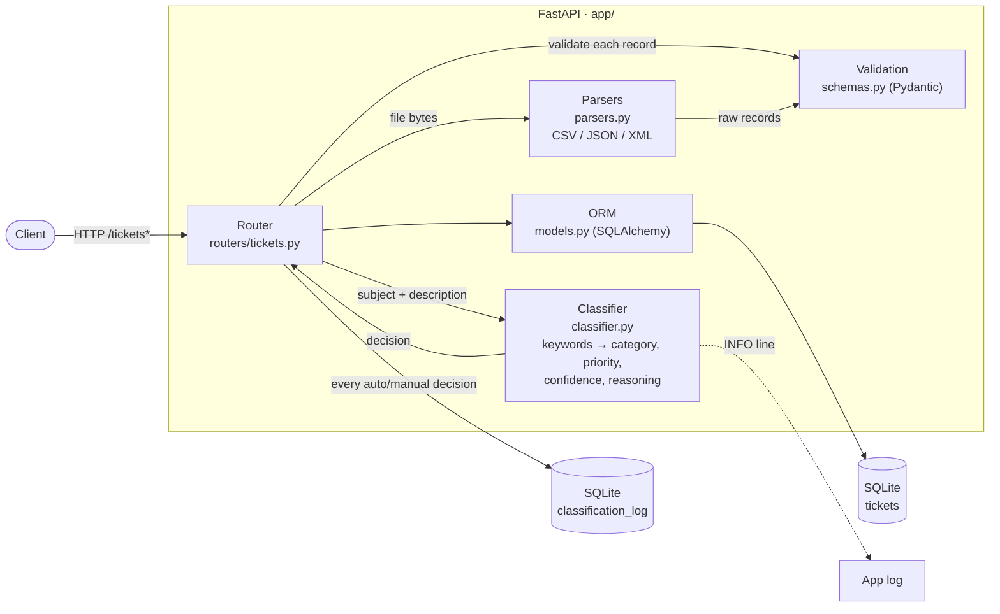

# Intelligent Customer Support System

A REST service that turns a pile of incoming support requests into an
organized, prioritized ticket queue. It ingests tickets one by one over
HTTP or in bulk from CSV / JSON / XML files, validates every record,
automatically assigns a category and priority with an explainable keyword
engine, and keeps a full audit trail of every classification decision —
automatic or human.

The service is built for teams that receive support requests from many
channels in many shapes: a web form here, an exported spreadsheet there.
Instead of trusting the incoming data, it validates each record
independently — one broken row never sinks a 1000-row import — and reports
exactly which records failed and why. Classification is deterministic and
transparent: every decision comes with the matched keywords, a confidence
score, and a plain-language reasoning string, so an agent can always see
*why* a ticket landed in a queue and override it when the machine got it
wrong.

**Features**

- Full ticket CRUD with filtering (status, priority, category, customer,
  assignee, tag, text search) and pagination
- Bulk import from CSV, JSON, and XML with automatic format detection
- Strict validation on every path: email format, string length bounds,
  closed enums (Pydantic v2)
- Per-record import error reporting: `total / successful / failed` summary
  with field-level messages for every rejected record
- Graceful handling of malformed files — broken JSON/XML, wrong encoding,
  empty or oversized uploads all return a clear 4xx, never a stack trace
- Auto-classification into 6 categories and 4 priority levels with a
  confidence score (0–1), human-readable reasoning, and the keywords found
- Optional classify-on-create: `?auto_classify=true` on single create and
  bulk import
- Manual override tracking: editing category/priority via `PUT` marks the
  ticket as human-classified (confidence 1.0)
- Append-only audit log of all classification decisions, queryable per
  ticket
- 58 tests (unit → API → integration → benchmarks) with an enforced
  85% coverage gate

**Stack:** Python 3.12+ · FastAPI · Pydantic v2 · SQLAlchemy 2 · SQLite ·
pytest · uv

## Architecture



Every request enters through the router, every piece of data passes through
Pydantic validation before touching the ORM, and every classification
decision is written twice: onto the ticket itself and into the append-only
`classification_log` table.

## API at a glance

| Method | Endpoint                           | Description                              |
|--------|------------------------------------|------------------------------------------|
| POST   | `/tickets`                         | Create a ticket (201); `?auto_classify=true` to classify on the fly |
| POST   | `/tickets/import`                  | Bulk import CSV/JSON/XML; returns per-record summary |
| GET    | `/tickets`                         | List with filters & pagination           |
| GET    | `/tickets/{id}`                    | Get one ticket (404 if missing)          |
| PUT    | `/tickets/{id}`                    | Partial update; category/priority edits are tracked as manual overrides |
| DELETE | `/tickets/{id}`                    | Delete (204)                             |
| POST   | `/tickets/{id}/auto-classify`      | Classify and apply; returns category, priority, confidence, reasoning, keywords |
| GET    | `/tickets/{id}/classification-log` | Audit trail of classification decisions  |
| GET    | `/health`                          | Liveness probe                           |

Full request/response details: interactive Swagger UI at `/docs`, and
`docs/API_REFERENCE.md`.

## Installation and setup

Prerequisites: [uv](https://docs.astral.sh/uv/) (installs the right Python
version itself — no system Python required):

```bash
brew install uv          # macOS; see uv docs for other platforms
```

Install and run:

```bash
uv sync                              # creates .venv and installs everything
uv run uvicorn app.main:app --reload # serves on http://127.0.0.1:8000
```

Open http://127.0.0.1:8000/docs for Swagger UI. Try a bulk import:

```bash
curl -X POST http://127.0.0.1:8000/tickets/import?auto_classify=true \
     -F 'file=@samples/sample_tickets.csv'
```

The SQLite database (`tickets.db`) is created automatically on startup.
There are no migrations yet — after pulling a change that alters the
schema, delete `tickets.db` and let the app recreate it.

## How to run tests

```bash
uv run pytest                                  # full suite + coverage gate (fails under 85%)
uv run pytest --no-cov                         # faster, no coverage
uv run pytest tests/test_ticket_api.py --no-cov       # one file
uv run pytest tests/test_performance.py -v --no-cov   # benchmarks, verbose
```

Current state: **58 tests, ~96% coverage** (gate: 85%).


## Project structure

```
app/
  main.py             # FastAPI app assembly, logging config, lifespan (creates tables)
  database.py         # engine/session factory; DATABASE_URL overridable via env
  models.py           # SQLAlchemy tables: Ticket + append-only ClassificationLog
  schemas.py          # single source of truth for validation rules and enums
  parsers.py          # CSV/JSON/XML → raw dicts; file-level errors only, records
                      #   are validated later so one bad row can't kill an import
  classifier.py       # deterministic keyword engine; returns category, priority,
                      #   confidence, reasoning, keywords — fully explainable
  routers/tickets.py  # all endpoints; import loop, audit logging, override tracking
tests/
  conftest.py         # isolated in-memory DB per test; file-backed DB for the
                      #   concurrency test; upload helpers
  test_*.py           # 8 files: API, model, CSV/JSON/XML import, categorization,
                      #   integration workflows, performance benchmarks
  fixtures/           # small data files wired into the automated tests
samples/              # 100 valid tickets (50 CSV / 20 JSON / 30 XML) + invalid/
                      #   set for negative testing — for manual and demo runs
scripts/
  generate_samples.py # regenerates samples/ and validates them against the app
docs/
  prompts/            # per-audience documentation generation plan
  screenshots/        # coverage report screenshot
```
