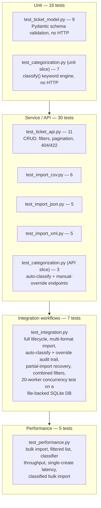
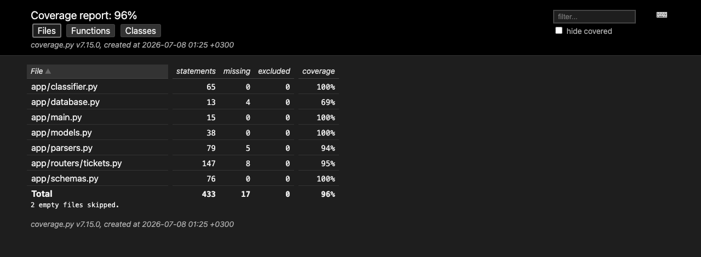

# Testing Guide

Handbook for QA engineers working on the support-ticket system. It covers
running the suite, what each test protects, manual test data, a scripted
manual-testing pass over a live server, performance benchmarks, and the
conventions for adding new tests.

Verified against this repo on 2026-07-08: **58 tests, 96.07% coverage**
(gate: 85%), all green.

---

## 1. Test pyramid



Notes:

- `test_categorization.py` straddles two levels: 7 tests call `classify()`
  directly (unit), 3 exercise `/tickets/{id}/auto-classify` and manual
  override through the API (service/API level). Both live in the same file
  because they cover the same feature — see the suite map below for the
  file-level count (10 total).
- **No E2E / browser tier.** The service has no UI layer — no HTML pages,
  no JS client — so there is nothing for a browser-driven E2E test to
  exercise. The top of this pyramid stops at integration + performance.
  If a UI is ever added, an E2E tier belongs above Performance, driving the
  real endpoints through the browser.
- 58 tests total: 16 unit + 30 service/API + 7 integration + 5 performance.

---

## 2. How to run tests

```bash
# Full suite with the coverage gate (fails the run if coverage < 85%)
uv run pytest

# Same tests, no coverage bookkeeping (faster local loop)
uv run pytest --no-cov

# Single file
uv run pytest tests/test_ticket_api.py --no-cov

# Single test
uv run pytest tests/test_ticket_api.py::test_create_ticket_returns_201_with_defaults --no-cov

# Verbose benchmark run (see each benchmark pass/fail individually)
uv run pytest tests/test_performance.py -v --no-cov
```

### Reading the coverage table

`uv run pytest` (no `--no-cov`) prints a table like this at the end of the
run:

```
Name                     Stmts   Miss  Cover   Missing
------------------------------------------------------
app/classifier.py           65      0   100%
app/database.py             13      4    69%   20-24
app/main.py                 15      0   100%
app/models.py               38      0   100%
app/parsers.py               79      5    94%   28, 30-31, 118, 124
app/routers/tickets.py      147      8    95%   86, 106, 116, 139, 171, 177, 179, 230
app/schemas.py               76      0   100%
------------------------------------------------------
TOTAL                       433     17    96%
```

- **Stmts / Miss / Cover** — statements in the file, how many were never
  executed, and the resulting percentage.
- **Missing** — exact line numbers not hit by any test. Use this to decide
  whether a gap is worth closing (a real branch nobody tests) or is
  acceptable (e.g. `app/database.py`'s `get_db()` is the *production*
  dependency; tests override it with an in-memory session, so it is
  legitimately never exercised).
- Current baseline is **~96%** total, comfortably above the 85% gate. The
  gaps above are all known and low-risk: the real DB session wiring, the
  `>10,000 records` import guard, and a couple of defensive filter
  branches in the router.

### When the gate trips

`--cov-fail-under=85` in `pyproject.toml` makes `uv run pytest` exit
non-zero if total coverage drops below 85%, even if every test passes.

1. Run `uv run pytest` (with coverage) and read the `Missing` column for
   the file(s) whose percentage dropped.
2. Open those line numbers — they are new/changed code with no test.
3. Add a test that exercises that path (see "Adding new tests" below), or
   if the code is genuinely equivalent to an existing test, extend that
   test instead of adding a near-duplicate.
4. Re-run `uv run pytest` until the gate passes. Do not raise or remove
   `--cov-fail-under` to work around a real gap.

---

## 3. Test suite map

| File | Scope | Count | Protects |
|---|---|---|---|
| `test_ticket_api.py` | CRUD endpoints | 11 | Create defaults, get/404, list filters (category/priority/tag/search), pagination + `limit=0` rejection, bad enum filter → 422, update/resolve/reopen, unknown-field rejection, delete + 404 |
| `test_ticket_model.py` | Pydantic schemas | 9 | Field defaults, email format, subject/description length bounds, category/priority/status enums, metadata enum + required `source`, `extra="forbid"` on create/update |
| `test_import_csv.py` | CSV parsing/import | 6 | Tags (`;`-split) + metadata mapping, per-row error reporting, header-consumes-first-row edge case, empty file → 400, non-UTF-8 → 400, content-type-only detection (no extension) |
| `test_import_json.py` | JSON parsing/import | 5 | Plain array vs `{"tickets": [...]}` wrapper, malformed JSON → 400, non-array payload → 400, non-object items reported as per-record failures |
| `test_import_xml.py` | XML parsing/import | 5 | `<tickets><ticket>` and bare `<ticket>` roots, tags/metadata elements, malformed XML → 400, no `<ticket>` elements → 400, per-record validation errors |
| `test_categorization.py` | Classifier + classify endpoints | 10 | Keyword→category/priority rules, confidence bounds, bug vs. technical-issue tie-break, no-keyword fallback to `other`, `/auto-classify` endpoint, manual override via `PUT` + audit log entries |
| `test_integration.py` | End-to-end workflows | 7 | Full lifecycle (create→classify→resolve→delete), multi-format import + combined filtering, import-with-auto-classify workflow, override audit trail across multiple updates, partial-import-then-fix-record recovery, **20-worker concurrent create/read/update on a file-backed DB** |
| `test_performance.py` | Benchmarks | 5 | Bulk import throughput, filtered listing latency, classifier throughput, single-create latency, classified bulk-import throughput — see section 6 |

**58 tests total.**

### `tests/fixtures/` (used by automated tests)

| File | Used by | Purpose |
|---|---|---|
| `sample.csv` | `test_import_csv.py`, `test_integration.py` | 2 valid rows with tags + mixed metadata (one row has no browser) |
| `sample.json` | `test_import_json.py`, `test_integration.py` | 2 valid records, used both as a plain array and wrapped in `{"tickets": [...]}` |
| `sample.xml` | `test_import_xml.py`, `test_integration.py` | 1 valid `<tickets><ticket>` record with tags + metadata |
| `invalid_rows.csv` | `test_import_csv.py`, `test_integration.py` | 1 valid + 1 row with a bad email, to test partial-success reporting |
| `malformed.json` | `test_import_json.py` | Truncated JSON, to test the 400 "Malformed JSON" path |
| `malformed.xml` | `test_import_xml.py` | Unclosed tag, to test the 400 "Malformed XML" path |

### conftest fixtures — when to use each

| Fixture | Use when... |
|---|---|
| `client` | Default choice for any endpoint test. In-memory SQLite (`StaticPool`), fully isolated per test, fast. Cannot serve truly concurrent requests (single shared connection). |
| `file_client` | You need real concurrency (multiple threads hitting the API at once). Backed by a file-based SQLite DB in `tmp_path` with its own connection per request. Used only by the 20-worker test in `test_integration.py`. |
| `upload` | You need to POST raw bytes/string content to `/tickets/import` with a specific filename or `Content-Type` (e.g. to test format detection, bad encoding, or hand-built payloads). |
| `upload_fixture` | You want to import one of the files in `tests/fixtures/` by name, without re-reading it yourself. |
| `ticket_payload` | You need a valid, ready-to-post ticket body and don't care about its exact contents. |

### Coverage report



---

## 4. Sample test data locations

Two separate datasets, two separate purposes:

- **`tests/fixtures/`** — small (1-2 records per file), hand-crafted,
  wired directly into the automated suite (see table above). Do not use
  these for manual exploratory testing; they exist to make assertions
  precise and fast.
- **`samples/`** — large, generated datasets for manual and exploratory
  testing against a running server. Not used by `pytest` at all.

### `samples/` (valid data)

| File | Format | Records |
|---|---|---|
| `samples/sample_tickets.csv` | CSV | 50 |
| `samples/sample_tickets.json` | JSON | 20 |
| `samples/sample_tickets.xml` | XML | 30 |

Importing all three against a clean database yields **0 failed** records
in every summary (verified — see section 5).

### `samples/invalid/` (negative testing)

Per-record-broken files (parse successfully, individual records fail
schema validation — partial success summaries):

| File | Records | Valid | Failed | Failure reasons |
|---|---|---|---|---|
| `invalid_tickets.csv` | 6 | 2 | 4 | bad email; description too short; bad category + bad priority; missing `customer_name` + subject over 200 chars |
| `invalid_tickets.json` | 5 | 1 | 4 | bad email; bad status + bad priority; missing required fields; non-object array item (`"_raw"` extra-input error) |
| `invalid_tickets.xml` | 4 | 1 | 3 | bad email; bad `metadata.source` + bad `metadata.device_type`; description too short |

Structurally-broken files (the whole file is rejected, `400` before any
record is parsed):

| File | Expected result |
|---|---|
| `malformed.json` | 400, `"Malformed JSON at line 2, column 1: ..."` |
| `malformed.xml` | 400, `"Malformed XML: no element found: line 2, column 0"` |
| `empty.csv` | 400, `"Uploaded file is empty"` |
| `not_utf8.csv` | 400, `"File is not valid UTF-8 text"` |
| `unsupported.txt` | 400, `"Unsupported file format. Upload a .csv, .json or .xml file (or set a matching Content-Type)."` |

### Regenerating samples

```bash
PYTHONPATH=. uv run python scripts/generate_samples.py
```

The script writes the files above, then re-parses and re-validates every
one of them through the real `app.parsers` / `app.schemas` code and prints
`OK`/`FAIL` per file — run it after touching validation rules or the
parsers, and confirm every line says `OK`.

---

## 5. Manual testing checklist

Start the server (any free port; example uses 8022 so it doesn't collide
with a `--reload` instance on 8000):

```bash
uv run uvicorn app.main:app --port 8022
```

This creates `tickets.db` in the working directory on first request.
**Delete it when you're done** (`rm tickets.db`) so the next run starts
clean.

All checks below were walked end-to-end against a live server and every
expected result was observed as written.

### CRUD lifecycle

- [ ] `POST /tickets` with a valid body → `201`, response has a generated
      `id`, `status: "new"`, `resolved_at: null`, `classification_source: null`
- [ ] `GET /tickets/{id}` for that ticket → `200`, fields match what was posted
- [ ] `GET /tickets` (no filters) → `200`, array containing the ticket
- [ ] `GET /tickets?category=<its category>` → array contains only matching tickets
- [ ] `GET /tickets?priority=<its priority>` → same
- [ ] `GET /tickets?status=new` → same
- [ ] `GET /tickets?tag=<one of its tags>` → same
- [ ] `GET /tickets?search=<a word from its subject/description>` → same
- [ ] `GET /tickets?customer_id=<its customer_id>` → same
- [ ] `GET /tickets?status=bogus` → `422` (invalid enum value)
- [ ] `PUT /tickets/{id}` with `{"status": "resolved", "assigned_to": "agent.smith"}` →
      `200`, `status: "resolved"`, `resolved_at` is now non-null, `assigned_to` set
- [ ] `DELETE /tickets/{id}` → `204`
- [ ] `GET /tickets/{id}` after delete → `404`, `{"detail": "Ticket <id> not found"}`
- [ ] `GET /tickets/no-such-id` → `404`
- [ ] `PUT /tickets/no-such-id` → `404`
- [ ] `DELETE /tickets/no-such-id` → `404`

### Bulk import — valid samples

- [ ] `POST /tickets/import` with `samples/sample_tickets.csv` →
      `200`, `total_records: 50, successful: 50, failed: 0`
- [ ] `POST /tickets/import` with `samples/sample_tickets.json` →
      `200`, `total_records: 20, successful: 20, failed: 0`
- [ ] `POST /tickets/import` with `samples/sample_tickets.xml` →
      `200`, `total_records: 30, successful: 30, failed: 0`
- [ ] `GET /tickets?limit=500` after all three → 100 tickets total

### Bulk import — invalid samples

- [ ] `samples/invalid/invalid_tickets.csv` → `200`, `total_records: 6,
      successful: 2, failed: 4`; `errors[0].errors` mentions `customer_email`
- [ ] `samples/invalid/invalid_tickets.json` → `200`, `total_records: 5,
      successful: 1, failed: 4`; last error mentions `_raw: Extra inputs are not permitted`
- [ ] `samples/invalid/invalid_tickets.xml` → `200`, `total_records: 4,
      successful: 1, failed: 3`; one error mentions both `metadata.source` and `metadata.device_type`
- [ ] `samples/invalid/malformed.json` → `400`, detail starts with `"Malformed JSON"`
- [ ] `samples/invalid/malformed.xml` → `400`, detail starts with `"Malformed XML"`
- [ ] `samples/invalid/empty.csv` → `400`, `"Uploaded file is empty"`
- [ ] `samples/invalid/not_utf8.csv` → `400`, `"File is not valid UTF-8 text"`
- [ ] `samples/invalid/unsupported.txt` → `400`, `"Unsupported file format..."`
- [ ] Oversized upload (> 10 MB; generate a throwaway file, do not commit it):

      ```bash
      head -1 samples/sample_tickets.csv > /tmp/oversized.csv
      dd if=/dev/zero bs=1048576 count=11 | tr '\0' 'x' >> /tmp/oversized.csv
      curl -s -w '\nHTTP %{http_code}\n' -X POST http://127.0.0.1:8022/tickets/import \
           -F 'file=@/tmp/oversized.csv;type=text/csv'
      rm /tmp/oversized.csv
      ```

      → `413`, `{"detail": "File exceeds the 10 MB upload limit"}`

### Auto-classify flow + audit log

- [ ] `POST /tickets` with a billing-shaped ticket (mentions "invoice",
      "charged twice", "refund"), no `auto_classify` param →
      `category: "other"` (default, not yet classified)
- [ ] `POST /tickets/{id}/auto-classify` →
      `200`, `category: "billing_question"`, `0 < confidence <= 1`,
      `keywords_found` non-empty, `reasoning` mentions `billing_question`
- [ ] `GET /tickets/{id}` afterwards → `category: "billing_question"`,
      `classification_source: "auto"`, `classification_confidence` matches, `classified_at` set
- [ ] `PUT /tickets/{id}` with `{"category": "other", "priority": "low"}` →
      `200`, `classification_source: "manual"`, `classification_confidence: 1.0`
- [ ] `GET /tickets/{id}/classification-log` → 2 entries: `[0].source ==
      "auto"` with the original category/keywords, `[1].source == "manual"`
      with `reasoning` containing `"Manual override"`
- [ ] `POST /tickets/no-such-id/auto-classify` → `404`
- [ ] `GET /tickets/no-such-id/classification-log` → `404`

### Swagger UI spot-check

- [ ] `GET /docs` → `200`, interactive Swagger UI loads
- [ ] `GET /openapi.json` → `200`, `paths` includes all of `/tickets`,
      `/tickets/import`, `/tickets/{ticket_id}`, `/tickets/{ticket_id}/auto-classify`,
      `/tickets/{ticket_id}/classification-log`, `/health`
- [ ] Try `POST /tickets` from the Swagger "Try it out" panel with the
      example body → `201` with a real ticket back

### Cleanup

- [ ] Stop the server (`Ctrl-C` or `kill` the process)
- [ ] `rm tickets.db` so the next manual pass starts from an empty database

---

## 6. Performance benchmarks

All in `tests/test_performance.py`. Thresholds are deliberately generous
(several times the typical actual) to stay stable across slower CI
hardware — a single 2-3x slowdown should never flake the suite.

"Typical actual" below is from a local run on this machine and is
**indicative only** — expect it to vary by hardware and load; what
matters is staying well under the threshold.

| Scenario | Dataset | Threshold | Typical actual (local, indicative) | Test name |
|---|---|---|---|---|
| Bulk import via `/tickets/import`, no classification | 1000 JSON records | < 5s | ~0.15s | `test_bulk_import_1000_records_under_5s` |
| Filtered list `GET /tickets?search=refund&limit=500` | 1000 tickets already imported | < 1s | ~0.01s | `test_list_with_filters_on_1000_tickets_under_1s` |
| Raw `classify()` calls in a loop | 1000 calls, 5 subject/description templates cycled | < 2s | ~0.13s | `test_classifier_throughput_1000_calls_under_2s` |
| Average latency of a single `POST /tickets` | 30 sequential creates | < 100ms average | ~1.7ms average | `test_single_create_latency` |
| Bulk import with `auto_classify=true` | 500 JSON records | < 5s | ~0.20s | `test_import_with_auto_classify_500_records_under_5s` |

Run just this file, verbosely, to see each benchmark pass/fail on its own:

```bash
uv run pytest tests/test_performance.py -v --no-cov
```

If a benchmark fails, re-run it in isolation first (`uv run pytest
tests/test_performance.py::test_name -v --no-cov`) to rule out noisy
neighbor processes before treating it as a real regression — the
thresholds have deep margin, so a genuine failure usually means an actual
algorithmic regression (e.g. an accidental N+1 query), not machine noise.

---

## 7. Adding new tests

1. **Pick the right file** — match the suite map in section 3:
   - New endpoint or CRUD behavior → `test_ticket_api.py`
   - New/changed Pydantic validation rule → `test_ticket_model.py`
   - Format-specific parsing/import behavior → `test_import_csv.py` /
     `test_import_json.py` / `test_import_xml.py`
   - Classifier keyword/priority rule or the classify/override endpoints →
     `test_categorization.py`
   - A workflow that spans multiple endpoints, or anything needing real
     concurrency → `test_integration.py`
   - A new throughput/latency budget → `test_performance.py`

   Don't invent a 9th file for a one-off test; it dilutes the map above.

2. **Use the fixtures, not raw `TestClient`.** Take `client` (or
   `file_client` for concurrency) as a test argument instead of
   constructing an engine/session/`TestClient` by hand — that duplicates
   `conftest.py` and loses the per-test isolation it guarantees. Use
   `upload` / `upload_fixture` for import tests instead of building
   `files={...}` dicts inline.

3. **Fixtures vs. samples** — if your test asserts on exact values, add a
   small file to `tests/fixtures/` (or extend an existing one) and wire it
   through `upload_fixture`. Never point an automated test at `samples/`:
   those files are large, regenerated with a random seed, and meant for
   humans clicking through Swagger, not for `assert` statements.

4. **Keep the coverage gate green.** After adding code, run `uv run
   pytest` (with coverage) and check the `Missing` column for the file you
   touched — a new branch with no test will show up there immediately.
   Add the missing case rather than lowering `--cov-fail-under`.

5. **Match existing style**: short docstring at the top of the test file
   stating the file's scope and test count (keep that count updated when
   you add/remove tests — the suite map and README both quote it), one
   assertion-dense test per behavior rather than many trivial tests, and
   prefer real HTTP round-trips through `client` over reaching into the
   ORM directly.
