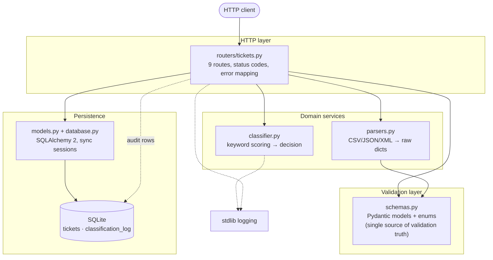
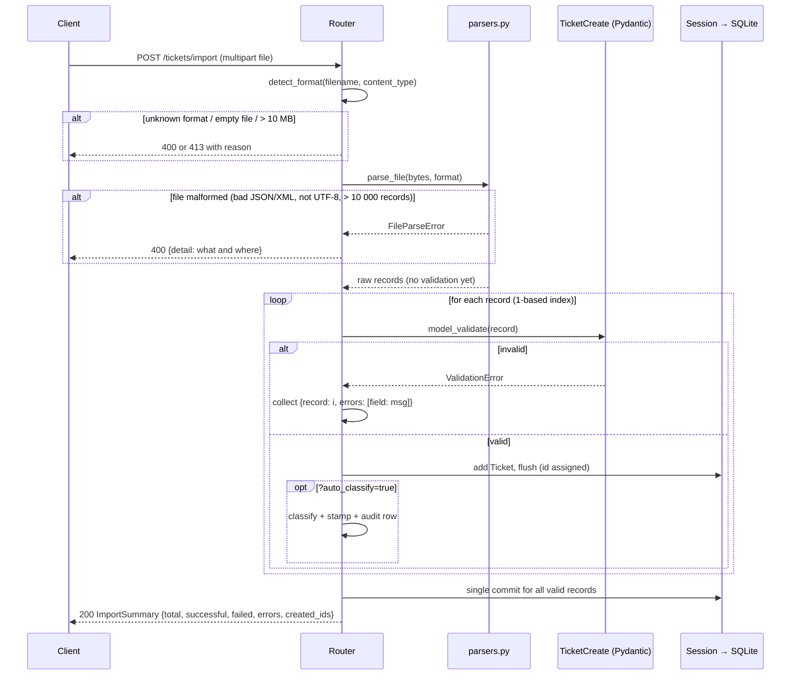
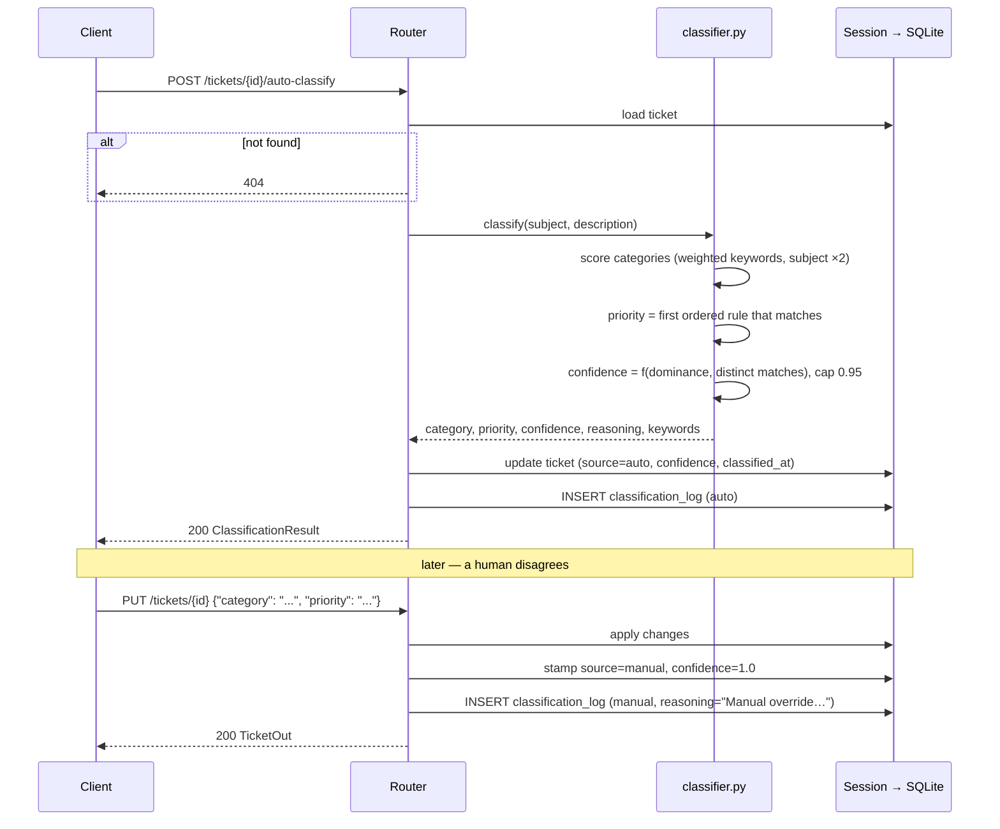

# Architecture

**Author:** Vitalii Roditieliev

Audience: technical leads deciding whether this design is sound, where it
will break under growth, and what to invest in next. This document assesses;
it does not sell.

## 1. High-level architecture

The system is a single FastAPI process over a single SQLite file. Layering
is strict in one direction: the router orchestrates everything, domain
services (parsers, classifier) are pure functions with no knowledge of HTTP
or the database, and all validation authority lives in the Pydantic schemas.
There is deliberately no service/repository layer between the router and the
ORM — at ~150 statements the router is small enough that the indirection
would cost more than it buys. The audit trail is a side-channel: every
classification decision is written both onto the ticket row and into an
append-only `classification_log` table.

## 2. Components

| Module | Responsibility | Deliberately does NOT |
|---|---|---|
| `src/app/main.py` | App assembly: logging config, lifespan (`create_all`), router registration, `/health` | Contain any business logic |
| `src/app/database.py` | Engine + session factory; `DATABASE_URL` env override; `get_db` dependency | Manage migrations or pooling policy beyond defaults |
| `src/app/models.py` | Two tables: `Ticket` (UUID pk, JSON columns for tags/metadata, classification fields) and `ClassificationLog` (append-only, intentionally no FK) | Enforce enum values — that is the schema layer's job; the DB stores plain strings |
| `src/app/schemas.py` | All validation rules: length bounds, `EmailStr`, six enums, `extra="forbid"`; separate Create/Update/Out models | Leak ORM concerns; `TicketOut` maps the `meta` attribute back to the `metadata` wire name |
| `src/app/parsers.py` | Bytes → list of raw dicts per format; format detection (extension, then Content-Type); file-level failures as `FileParseError` | Validate records — a parser that rejects rows would re-implement the schemas and break per-record error reporting |
| `src/app/classifier.py` | Deterministic keyword engine: weighted category scores (subject ×2), ordered priority rules, confidence formula, reasoning string | Call any external service; hold any state; touch the DB |
| `src/app/routers/tickets.py` | Orchestration: CRUD, the import loop (parse → validate each → persist valid), classification application, manual-override detection, audit rows | Parse files or score keywords itself |

Key invariants worth protecting in review:

- **Every write path to `category`/`priority` leaves a trace**: auto paths
  stamp `classification_source="auto"` + confidence + audit row; `PUT`
  edits stamp `"manual"` + confidence 1.0 + audit row.
- **`resolved_at` is managed, not client-supplied**: set on transition to
  `resolved`/`closed`, cleared on reopen.
- **Import never partially validates a record**: a record either fully
  passes `TicketCreate` or is reported with all its field errors.

## 3. Data flows

### Bulk import (`POST /tickets/import`)

Note the transactional shape: invalid records are *reported*, valid records
are *committed together at the end*. A crash mid-import loses the whole
batch (acceptable: the client retries the idempotent-enough upload) but can
never commit half-validated data.

### Auto-classification and manual override

## 4. Design decisions and trade-offs

**Rule-based keyword classifier instead of ML/LLM.**
Chosen for determinism, zero latency/cost, and full explainability — every
decision cites its keywords and score arithmetic, which is also what makes
the audit log meaningful. The cost is a hard recall ceiling: synonyms,
misspellings, and non-English text (a real concern for a Ukrainian customer
base) score zero and fall to `other`/`medium`. *Revisit when*: measured
share of `other` or manual overrides exceeds ~20–30% — then add an LLM
fallback for low-confidence tickets, keeping the keyword engine as the
cheap, explainable first pass. The seam is clean: `classify()` is a pure
function returning a result object; a second implementation slots in behind
the same signature.

**SQLite + `create_all` instead of a migration-managed database.**
Right for a development-stage service: zero infrastructure, trivially
resettable, and `create_all` keeps schema bootstrapping invisible. Two real
costs already felt: any schema change requires deleting `tickets.db`
(no upgrade path for accumulated data), and SQLite's single-writer model
caps concurrent write throughput. *Revisit when*: first deployment that
must retain data across releases — introduce Alembic then, and Postgres
when concurrent writers or dataset size demand it. `DATABASE_URL` is
already externalized, so the swap is configuration plus dialect testing.

**Per-record import validation instead of all-or-nothing.**
A support-ticket import is exactly the workload where 3 broken rows must
not block 997 good ones; the summary with field-level errors makes the
failure actionable. The trade-off is that "the file was imported" is not a
binary fact — consumers must read the summary. All valid records still
commit atomically at the end, so there is no partially-written record.

**Append-only audit table without a foreign key.**
`classification_log.ticket_id` is a plain indexed string so audit history
survives ticket deletion — an audit trail that disappears with its subject
is not an audit trail. Costs: no referential integrity (orphan rows are
expected, not a bug) and no automatic cleanup; the table grows forever.
*Revisit when*: volume forces retention policy — archive by `created_at`,
never mutate.

**Synchronous SQLAlchemy inside async FastAPI.**
Endpoints are `def` (except the upload reader), so FastAPI runs them in its
threadpool; SQLite calls block a worker thread, not the event loop. This is
the simplest correct configuration for SQLite and removes an entire class
of async-session bugs. It does become a ceiling with a network database and
high concurrency (threadpool exhaustion). *Revisit when*: moving to
Postgres under real load — either async engine or a bigger threadpool,
measured first.

**Known wart: `tag` filtering happens in Python after SQL pagination**
(`routers/tickets.py`, `list_tickets`). A page of 50 can return fewer than
50 matching tickets even when more exist, because the tag predicate runs on
the already-paginated rows. Acceptable while tags are a JSON column in
SQLite; fix properly with a JSON containment query or a tag join table when
moving to Postgres. This is documented here precisely so it is not
rediscovered as a bug.

## 5. Security considerations

Current posture: a development service with **no security boundary of its
own**. Honest inventory, ranked by what must change before any production
exposure:

1. **No authentication or authorization.** Every endpoint is anonymous;
   anyone who can reach the port can read, create, delete, and rewrite
   history. Blocker for any non-local deployment. Add an auth dependency
   (API keys or OIDC) at the router level — the dependency-injection seam
   is already there.
2. **PII in plaintext.** Names and emails sit unencrypted in an unencrypted
   SQLite file with no access audit (the audit log covers classification,
   not reads). GDPR-relevant the moment real customer data enters.
3. **No rate limiting.** The only DoS guards are the 10 MB upload cap and
   the 10 000-record cap — both present and tested, but nothing throttles
   request *frequency*.
4. **No CORS policy configured** — irrelevant for server-to-server use,
   must be decided deliberately before any browser frontend appears.
5. **XML parsing uses stdlib `ElementTree`**, which does not resolve
   external entities — the classic XXE vector is closed by default. Worth
   stating so nobody "improves" the parser with a less safe library. If
   attacker-supplied XML becomes routine, move to `defusedxml` for
   defense in depth (entity-expansion bombs).
6. **Input validation is genuinely strict** (closed enums, length bounds,
   `extra="forbid"`, SQLAlchemy parameterization throughout) — injection
   surface is minimal. This is the one area already at production grade.

## 6. Performance considerations

Measured envelope (thresholds from `tests/test_performance.py`; real runs
are roughly an order of magnitude under them — the full 58-test suite,
including all benchmarks below, completes in ~1.3 s):

| Scenario | Threshold | Test |
|---|---|---|
| Bulk import, 1 000 JSON records | < 5 s | `test_bulk_import_1000_records_under_5s` |
| Filtered list over 1 000 tickets | < 1 s | `test_list_with_filters_on_1000_tickets_under_1s` |
| 1 000 classifier calls | < 2 s | `test_classifier_throughput_1000_calls_under_2s` |
| Single create, average of 30 | < 100 ms | `test_single_create_latency` |
| Import + classify, 500 records | < 5 s | `test_import_with_auto_classify_500_records_under_5s` |

Known ceilings, in the order they will be hit:

1. **SQLite's single writer.** Concurrent writes serialize on a file lock;
   the 20-worker integration test passes because writes are short, but
   sustained parallel import traffic will queue. First real scaling step is
   Postgres, not code.
2. **In-process, in-request import loop.** A 10 000-record file parses,
   validates, and commits inside one HTTP request. Fine at current caps;
   at larger volumes move imports to background jobs (even a thread queue
   buys headroom before reaching for Celery/arq).
3. **Classifier is O(keywords × text) uncompiled regex** — ~90 patterns
   compiled per call via `re`'s cache. At ~0.5 ms/call it is nowhere near
   the bottleneck; if it ever is, precompile patterns at import time
   (one-line change) before considering anything fancier.
4. **`limit ≤ 500` with offset pagination** degrades on deep pages at
   large table sizes; switch to keyset pagination alongside the Postgres
   move.

The honest summary: every current bottleneck is a deliberate simplicity
choice with a known, incremental exit — nothing in the design requires a
rewrite to scale to a realistically loaded single-team deployment.
