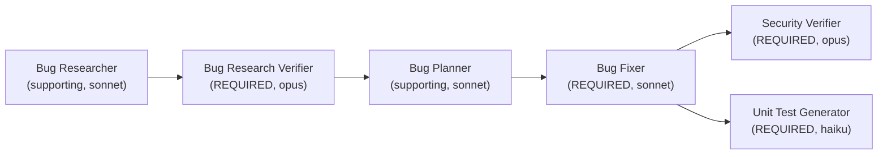

# Homework: 4-Agent Bug-Fix Pipeline

**Author / Student**: Vitaliy Roditelev (vitaliy.roditelev@gmail.com)

## Overview

This repo implements a 4-agent pipeline that finds, verifies, fixes, security-reviews,
and test-covers bugs in a small sample application, plus the sample application
itself with seeded issues for the pipeline to operate on.



Run order: **Bug Researcher → Bug Research Verifier → Bug Planner → Bug Fixer
→ Security Verifier (on changed code) → Unit Test Generator (on changed
code)**, executed end-to-end by a single command (`./run-pipeline.sh`) — see
[HOWTORUN.md](HOWTORUN.md).

Bug Researcher and Bug Planner are supporting roles (not part of the 4
required, graded agents) included only so the pipeline is runnable
end-to-end from one command; they produce the `research/codebase-research.md`
and `implementation-plan.md` inputs that the two research-side required
agents and the fixer consume.

## The sample application (Task 5)

`src/expense_tracker.py` — a minimal SQLite-backed **Expense Tracker CLI**
(`add`, `list`, `total`, `discount`, `search`), zero external dependencies
(Python stdlib only: `argparse`, `sqlite3`).

Seeded issues (documented in detail in
[`context/bugs/001/bug-context.md`](context/bugs/001/bug-context.md)):

1. **Bug 1** — `calculate_total` off-by-one: the summation loop starts at
   index `1` instead of `0`, silently dropping the first expense from every
   total.
2. **Bug 2** — `apply_member_discount` inverted rate: multiplies by `1.1`
   instead of `0.9`, so members are *overcharged* 10% instead of
   discounted.
3. **Security issue** — SQL injection (CWE-89) in `search_expenses`: the
   search keyword is string-concatenated directly into the SQL query
   instead of using a parameterized query.

`tests/test_expense_tracker.py` encodes the *correct* behavior for all
three — 4 of its 8 tests fail against the seeded code and pass once the
pipeline's Bug Fixer applies the fix (see [HOWTORUN.md](HOWTORUN.md) for
before/after commands).

## Agents (`agents/*.agent.md`)

| Agent | Required? | Model | Why this model |
|---|---|---|---|
| `bug-researcher.agent.md` | supporting | `sonnet` | Open-ended code investigation benefits from a capable model, but it's not a graded deliverable so doesn't need the top tier. |
| `research-verifier.agent.md` | **Task 1** ⭐ | `opus` | Fact-checking is adversarial-by-design: it has to *doubt* the researcher's claims and catch subtle file:line / snippet mismatches or wrong root causes. That needs the strongest available reasoning, since an error here silently poisons every downstream stage. |
| `bug-planner.agent.md` | supporting | `sonnet` | Turning verified findings into literal before/after code + a test command is moderate reasoning — more judgment than pure scaffolding, less than adversarial verification. |
| `bug-fixer.agent.md` | **Task 2** ⭐⭐ | `sonnet` | The *what* and *why* are already decided by the approved plan; the job is reliable, literal multi-file editing plus interpreting real test output — routine but not the cheapest tier, since correctness of the applied diff still matters. |
| `security-verifier.agent.md` | **Task 3** ⭐⭐ | `opus` | Same rationale as the research verifier: distinguishing a real, exploitable vulnerability from noise (and rating severity correctly) needs adversarial, careful reasoning, not pattern matching. |
| `unit-test-generator.agent.md` | **Task 4** ⭐⭐⭐ | `haiku` | Given the FIRST skill and an existing test file's conventions as a template, writing additional focused test cases for already-identified changed functions is mechanical scaffolding — the fastest/cheapest tier is enough, and it keeps the highest-volume stage (many small test cases) cheap. |

Each agent's exact model is declared in its own frontmatter
(`model: opus|sonnet|haiku`) per the homework's requirement, and
`run-pipeline.sh` passes the matching `--model` flag when invoking it.

## Skills (`skills/*.md`)

- **`research-quality-measurement.md`** (Task 1.2) — a 4-dimension rubric
  (reference accuracy, root-cause identification, completeness,
  actionability; 0–3 each) mapping a 0–12 score to
  `EXCELLENT / GOOD / ADEQUATE / POOR`, plus a PASS/FAIL gate. Used by
  `research-verifier.agent.md` to score `verified-research.md`.
- **`unit-tests-FIRST.md`** (Task 4.2) — defines **F**ast, **I**ndependent,
  **R**epeatable, **S**elf-validating, **T**imely with a concrete
  per-letter checklist and a required "FIRST Compliance" report format.
  Used by `unit-test-generator.agent.md`.

## How the "single command" works

`./run-pipeline.sh [bug-id]` (default bug id `001`) runs all six stages via
headless `claude -p` calls, in order, with **no manual steps in between**.
Each stage:

- loads its persona from the matching `agents/*.agent.md` file via
  `--append-system-prompt` (which is where each agent's required skill is
  referenced and, therefore, effectively "auto-loaded" for that stage);
- runs with its own `--model` and a restricted `--allowedTools` list (e.g.
  the Security Verifier gets `Read Grep Glob Write` only — no `Edit`/`Bash`
  — enforcing "report only, never fix" at the tool-permission level, not
  just as an instruction);
- runs non-interactively (`--permission-mode bypassPermissions`) since there
  is no human in the loop to approve individual tool calls mid-pipeline.

See [HOWTORUN.md](HOWTORUN.md) for exact commands.

## Repository layout

```
.
├── README.md              # this file
├── HOWTORUN.md
├── run-pipeline.sh         # single-command pipeline entry point
├── agents/
│   ├── bug-researcher.agent.md        # supporting
│   ├── research-verifier.agent.md     # Task 1 (required)
│   ├── bug-planner.agent.md           # supporting
│   ├── bug-fixer.agent.md             # Task 2 (required)
│   ├── security-verifier.agent.md     # Task 3 (required)
│   └── unit-test-generator.agent.md   # Task 4 (required)
├── skills/
│   ├── research-quality-measurement.md  # Task 1.2
│   └── unit-tests-FIRST.md              # Task 4.2
├── context/bugs/001/
│   ├── bug-context.md
│   ├── research/codebase-research.md, verified-research.md
│   ├── implementation-plan.md
│   ├── fix-summary.md
│   ├── security-report.md
│   └── test-report.md
├── src/expense_tracker.py  # Task 5 sample app
├── tests/test_expense_tracker.py
└── docs/screenshots/
```

## Deliverables checklist

- [x] 4 required agents in `agents/` (+ 2 supporting agents for a runnable
      end-to-end pipeline)
- [x] `skills/research-quality-measurement.md`, `skills/unit-tests-FIRST.md`
- [x] Sample app in `src/` with 2 seeded bugs + 1 seeded security issue
- [x] Single-command pipeline (`./run-pipeline.sh`)
- [x] Agent outputs (`verified-research.md`, `fix-summary.md`,
      `security-report.md`, `test-report.md`) — generated by running the
      pipeline (see `context/bugs/001/`)
- [x] Screenshots in `docs/screenshots/`

## Pipeline run results (bug id `001`)

A real end-to-end run (`./run-pipeline.sh 001`) produced:

- **Bug Research Verifier**: `PASS`, Research Quality **EXCELLENT (12/12)**,
  24/24 claims verified, 0 discrepancies.
- **Bug Fixer**: all 3 planned changes applied; test suite went from 4
  failing / 8 total → 8/8 passing.
- **Security Verifier**: 0 CRITICAL / 0 HIGH / 0 MEDIUM / 3 LOW / 1 INFO —
  confirmed the CWE-89 fix is genuine (verified by executing the documented
  payload) and flagged 3 pre-existing LOW-severity issues in the touched
  file for follow-up.
- **Unit Test Generator**: 11 new edge-case tests added (empty/boundary
  inputs, rounding, special characters), full suite 19/19 passing, FIRST
  compliance reported.

Full run transcript: [`docs/pipeline-run.txt`](docs/pipeline-run.txt).

**Screenshots** ([`docs/screenshots/`](docs/screenshots/)):

| File | Shows |
|---|---|
| `01-pipeline-run.png` | `./run-pipeline.sh 001` full run — all 6 stage banners, output file checklist, final passing test run |
| `02-fixes-verified.png` | Manual verification commands against the fixed app: `total`→`15.50`, `discount`→`90.00`, SQL-injection payload → `(no expenses)` |
| `03-security-scan.png` | `security-report.md` — scope, dependency/web-surface analysis, severity summary table, verdict |
| `04-unit-tests.png` | `python3 -m unittest discover -s tests -v` — all 19 tests (8 original + 11 generated) passing |
